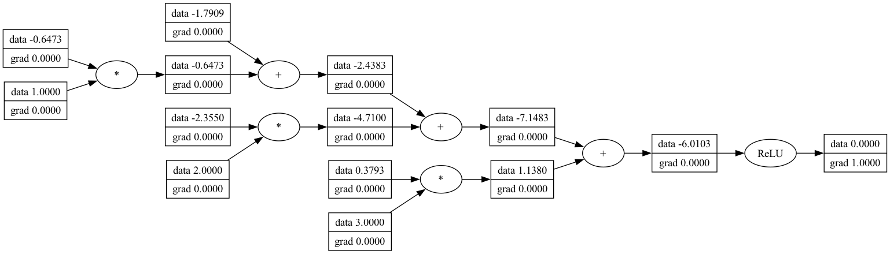

<!-- PROJECT SHIELDS -->
<!--
*** I'm using markdown "reference style" links for readability.
*** Reference links are enclosed in brackets [ ] instead of parentheses ( ).
*** See the bottom of this document for the declaration of the reference variables
*** for contributors-url, forks-url, etc. This is an optional, concise syntax you may use.
*** https://www.markdownguide.org/basic-syntax/#reference-style-links
-->
<div align="left">

[![Contributors][contributors-shield]][contributors-url]
[![Forks][forks-shield]][forks-url]
[![Stargazers][stars-shield]][stars-url]

</div>

<a href="https://github.com/Kaweees/kiwigrad">
  
</a>

<div align="left">
  <h1><em><a href="https://github.com/Kaweees/kiwigrad">~kiwigrad</a></em></h1>
</div>

<!-- ABOUT THE PROJECT -->
A scalar-valued automatic differentiation (autograd) engine for deep learning written in Zig.

### Built With

[![Zig][Zig-shield]][Zig-url]
[![NixOS][NixOS-shield]][NixOS-url]
[![GitHub Actions][github-actions-shield]][github-actions-url]

<!-- PROJECT PREVIEW -->
## Preview

<p align="center">
  
</p>

<!-- GETTING STARTED -->
## Getting Started

### Prerequisites

Before attempting to build this project, make sure you have [Nix](https://nixos.org/download.html) with [Flake](https://nixos.wiki/wiki/Flakes) support installed on your machine.

### Installation

To get a local copy of the project up and running on your machine, follow these simple steps:

1. Clone the project repository

   ```sh
   git clone https://github.com/Kaweees/kiwigrad.git
   cd kiwigrad
   ```

2. Install the project dependencies

   ```sh
   nix-shell --max-jobs $(nproc) # Linux / Windows (WSL)
   nix-shell --max-jobs $(sysctl -n hw.ncpu) # macOS
   ```

3. Build the project

   ```sh
   just build
   ```

4. Run the project

   ```sh
   just run
   ```

### Add as a dependency

To include `kiwigrad` in your Zig project, follow these steps:

1. Add to your `build.zig.zon` file via `zig fetch`:

   ```sh
   zig fetch --save git+https://github.com/Kaweees/kiwigrad.git
   ```

2. Add the following line to your `build.zig` file:

   ```zig
   const kiwigrad = @import("kiwigrad");

   pub fn build(b: *std.Build) void {
      // exe setup...

      const KiwiGrad_dep = b.dependency("kiwigrad", .{
         .target = target,
         .optimize = optimize,
      });

      const KiwiGrad_module = KiwiGrad_dep.module("kiwigrad");
      exe.root_module.addImport("kiwigrad", KiwiGrad_module);

      // additional build steps...
   }

   ```

## Usage

`kiwigrad` is designed to be easy to use. You can include the library in your Zig project by adding the following line to your source files:

```zig
const kiwigrad = @import("kiwigrad");
```

### Benchmarks

`kiwigrad` is capable of rendering 3D scenes with thousands of triangles at interactive frame rates. The following benchmarks were conducted on a 2019 MacBook Pro with a 2.3 GHz 8-Core Intel Core i9 processor and 16 GB of RAM.

| Benchmark | Description | Result |
| --------- | ----------- | ------ |
| `cube` | Render a cube with 12 triangles | 60 FPS |
| `sphere` | Render a sphere with 960 triangles | 60 FPS |
| `bunny` | Render a Stanford Bunny with 69451 triangles | 60 FPS |
| `dragon` | Render a Stanford Dragon with 871306 triangles | 60 FPS |

<!-- PROJECT FILE STRUCTURE -->
## Project Structure

```sh
kiwigrad/
├── .github/                       # GitHub Actions CI/CD workflows
├── src/                           # Library source files
│   ├── lib.zig                      # Public API entry point
│   └── ...
├── examples/                      # Example projects
│   ├── benchmark.zig                # Benchmarking the library
│   └── train.zig                    # Training a model on MNIST
├── build.zig                      # Zig build script
├── build.zig.zon                  # Zig build script dependencies
├── LICENSE                        # Project license
└── README.md                      # You are here
```

## License

The source code for [Kaweees/kiwigrad](https://github.com/Kaweees/kiwigrad) is distributed under the terms of the MIT License, as I firmly believe that collaborating on free and open-source software fosters innovations that mutually and equitably beneficial to both collaborators and users alike. See [`LICENSE`](./LICENSE) for details and more information.

<!-- MARKDOWN LINKS & IMAGES -->
<!-- https://www.markdownguide.org/basic-syntax/#reference-style-links -->

[contributors-shield]: https://img.shields.io/github/contributors/Kaweees/kiwigrad.svg?style=for-the-badge
[contributors-url]: https://github.com/Kaweees/kiwigrad/graphs/contributors
[forks-shield]: https://img.shields.io/github/forks/Kaweees/kiwigrad.svg?style=for-the-badge
[forks-url]: https://github.com/Kaweees/kiwigrad/network/members
[stars-shield]: https://img.shields.io/github/stars/Kaweees/kiwigrad.svg?style=for-the-badge
[stars-url]: https://github.com/Kaweees/kiwigrad/stargazers

<!-- MARKDOWN SHIELD BAGDES & LINKS -->
<!-- https://github.com/Ileriayo/markdown-badges -->
[Zig-shield]: https://img.shields.io/badge/Zig-%f7a41d.svg?style=for-the-badge&logo=zig&logoColor=f7a41d&labelColor=222222&color=f7a41d
[NixOS-shield]: https://img.shields.io/badge/NIX-%23008080.svg?style=for-the-badge&logo=NixOS&logoColor=5277C3&labelColor=222222&color=5277C3
[NixOS-url]: https://nixos.org/
[Zig-url]: https://ziglang.org/
[github-actions-shield]: https://img.shields.io/badge/github%20actions-%232671E5.svg?style=for-the-badge&logo=githubactions&logoColor=2671E5&labelColor=222222&color=2671E5
[github-actions-url]: https://github.com/features/actions
